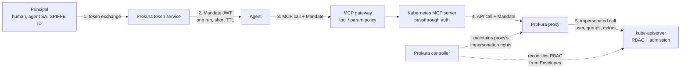

# Prokura

**Run-scoped Kubernetes identities for AI agents.**

Prokura gives each AI agent a run-scoped Kubernetes identity.

You define allowed tasks with `Envelope` resources. An envelope specifies:

* which Kubernetes resources the task can access
* which operations (`verbs`) are allowed
* which namespaces it can use
* whether approval is required
* how long the permission is valid
* how many API calls the run can make

An agent or human uses its own credential to request a `Mandate`. A mandate is a short-lived token for one run of one envelope.

The Prokura proxy sits in front of the Kubernetes API server. It validates the mandate and sends each request using an impersonated Kubernetes identity. The request includes the run ID, envelope, and original principal, so the action can be traced in the Kubernetes audit log.

Prokura does not require an authorization webhook. It works with EKS, GKE, and AKS.

It is also independent of the MCP gateway. You can use it with Traefik Hub, agentgateway, ToolHive, a Kubernetes MCP server, or another gateway.

*Prokura* is the Nordic and German legal term for a commercial power of attorney: a limited authorization to act on someone's behalf. That is the idea behind the project.

> **Status: pre-alpha.** The API group is `v1alpha1` and may change. The proxy has not received an independent security review. Use Prokura in development and test clusters, not production. Read [SECURITY.md](SECURITY.md) before relying on it for security.

---

## Why

AI agents are often given a Kubernetes credential that is valid for many different tasks. The credential may live in the agent's environment, where a prompt injection could potentially access it.

MCP gateways solve part of this problem. They can authorize individual tools and tasks using JWT claims. For example, Traefik uses TBAC, agentgateway uses CEL, and ToolHive uses Cedar.

However, the Kubernetes API server does not know about tasks.

The request that reaches `kube-apiserver` still has a Kubernetes identity. That identity's RBAC permissions determine what the request can actually do.

On managed Kubernetes services, such as EKS, GKE, and AKS, you cannot install a custom API-server authorizer to add task-level authorization. Kubernetes RBAC also cannot express that a credential is valid only for one specific run.

Prokura provides this missing layer between the gateway and the Kubernetes API server:

| Layer       | Enforces                                                                        | Who provides it                        |
| ----------- | ------------------------------------------------------------------------------- | -------------------------------------- |
| MCP gateway | Which tools and parameters are allowed for a task                               | Traefik Hub, agentgateway, ToolHive, … |
| **Prokura** | **Which Kubernetes identity a run uses, for how long, and in which namespaces** | this project                           |
| API server  | RBAC for that identity                                                          | Kubernetes                             |
| Admission   | Rules that must always apply, regardless of identity                            | Kyverno / ValidatingAdmissionPolicy    |
| Audit log   | What happened, correlated by run ID                                             | Kubernetes + your log store            |

---


## What it is not

Prokura is **not**:

* an MCP gateway
* a policy engine
* an agent runtime

It does not inspect MCP tool calls, evaluate Rego or Cedar, or run agents.

Its only job is to give a run a bounded Kubernetes identity.

This allows Prokura to work with the other components in your stack. Use an existing MCP gateway if you need tool-level authorization.

---

## How it works



### 1. Request a mandate

A principal requests a mandate for an envelope.

A principal can be:

* a person with an OIDC token
* a workload with a ServiceAccount token
* a workload with a SPIFFE JWT-SVID

The request uses RFC 8693 token exchange.

### 2. Create the mandate

The token service checks whether the principal is allowed to request the envelope.

It then creates a `Mandate` object.

If the envelope requires approval, the mandate remains pending until it is approved.

The service returns a JWT that is bound to this single run:

* `aud=prokura-proxy`
* `exp` = envelope TTL
* `jti` = run ID
* `prokura.dev/envelope`
* `prokura.dev/principal`
* `prokura.dev/ns`
* optional `prokura.dev/ticket`

### 3. Use the mandate

The agent uses the mandate for its Kubernetes requests.

The MCP gateway can use the envelope claim for its own authorization rules.

The Kubernetes MCP server forwards the token to Prokura.

### 4. Validate and proxy the request

The Prokura proxy validates the mandate:

* signature
* audience
* expiration
* revocation status
* call budget
* envelope scope

It then forwards the request to the Kubernetes API server using impersonation:

```text
Impersonate-User: prokura:envelope:<name>
Impersonate-Group: prokura:envelopes
Impersonate-Extra-prokura.dev/run: <jti>
```

### 5. Kubernetes enforces RBAC

The Prokura controller creates RBAC rules for the envelope identity.

For example:

```text
prokura:envelope:restart-deployment
```

The Kubernetes API server evaluates the request against these RBAC rules.

Admission policies can also see the impersonated identity and run ID. They can use this information to enforce additional rules.

For example, admission can:

* require a run ID
* restrict agent operations to labeled namespaces
* prevent changes to specific resources
* call an external authorization service

Kubernetes audit events contain both the proxy identity and the impersonated identity. The run ID is included as an extra field.

If someone bypasses the proxy, they do not gain the envelope permissions. Envelope identities can only be used through impersonation, and only the Prokura proxy ServiceAccount can impersonate them.

---

## Concepts

### Envelope

An `Envelope` is a cluster-scoped resource that defines a type of work.

It specifies:

* who can request it
* which resources it can access
* which operations are allowed
* which namespaces it can access
* its risk level
* mandate TTL
* call limit
* whether approval is required

The controller creates the required RBAC resources for the envelope identity.

It also restricts the proxy's impersonation permissions to the envelope identities that actually exist.

### Mandate

A `Mandate` represents one run of one envelope.

The token service creates a new mandate for every token exchange.

It contains:

* principal
* requested scope
* ticket
* current phase
* issue time
* expiration time
* call counter

The phase can be:

* `Pending`
* `Active`
* `Revoked`
* `Expired`

You can use:

```bash
kubectl get mandates
```

to see which agents currently have permissions.

Revoking a mandate immediately invalidates its token.

### Principal

A principal is the identity requesting a mandate.

Prokura supports three principal types in `v1alpha1`:

* `ServiceAccount` — validated using TokenReview
* `OIDC` — validated using the issuer's JWKS and claim matching
* `SPIFFE` — validated using a JWT-SVID and trust bundle endpoint

### Proxy

The proxy is a reverse proxy for the Kubernetes API server.

It is mostly stateless. It watches `Mandate` and `Envelope` resources.

It normally runs inside the cluster, but it can also run outside the cluster in front of a managed Kubernetes control-plane endpoint.

---

## Quick start

You need a Kubernetes cluster where you can create cluster-scoped resources. `kind` is sufficient.

You also need `kubectl` and `helm`.

```bash
kind create cluster --name prokura

helm install prokura oci://ghcr.io/prokura/charts/prokura \
  --namespace prokura-system --create-namespace

# A demo namespace that agents are allowed to use
kubectl create namespace demo
kubectl label namespace demo prokura.dev/agents=allowed
kubectl -n demo create deployment web --image=nginx:1.27
kubectl -n demo create serviceaccount demo-agent
```

Define an envelope for restarting a deployment:

```yaml
apiVersion: prokura.dev/v1alpha1
kind: Envelope
metadata:
  name: restart-deployment
spec:
  description: Roll the pods of a Deployment. Reversible, no data impact.
  tier: reversible                     # read | reversible | irreversible
  principals:
    - kind: ServiceAccount
      namespace: demo
      name: demo-agent
  scope:
    namespaces:
      selector:
        matchLabels:
          prokura.dev/agents: allowed
    rules:
      - apiGroups: ["apps"]
        resources: ["deployments"]
        verbs: ["get", "list", "watch", "patch"]
      - apiGroups: [""]
        resources: ["pods", "events"]
        verbs: ["get", "list", "watch"]
      - apiGroups: [""]
        resources: ["pods/log"]
        verbs: ["get"]
  mandate:
    ttl: 10m
    maxCalls: 50
  approval:
    required: false
```

Apply it:

```bash
kubectl apply -f envelope.yaml
kubectl get envelope restart-deployment

# NAME                 TIER         IDENTITY                               READY
# restart-deployment   reversible   prokura:envelope:restart-deployment    True
```

Request a mandate as the demo agent.

The quick start uses a ServiceAccount token. In a real deployment, use an OIDC token or SPIFFE JWT-SVID.

```bash
kubectl -n prokura-system port-forward svc/prokura 8443:443 &

SUBJECT=$(kubectl -n demo create token demo-agent --audience prokura --duration 5m)

MANDATE=$(curl -sS --cacert <(kubectl -n prokura-system get secret prokura-ca -o jsonpath='{.data.ca\.crt}' | base64 -d) \
  https://localhost:8443/v1/token \
  -d grant_type=urn:ietf:params:oauth:grant-type:token-exchange \
  -d subject_token="$SUBJECT" \
  -d subject_token_type=urn:ietf:params:oauth:token-type:jwt \
  -d audience=prokura-proxy \
  -d scope='envelope:restart-deployment ns:demo ticket:OPS-123' \
  | jq -r .access_token)

kubectl get mandates

# NAME                       ENVELOPE             PRINCIPAL                              PHASE    EXPIRES
# restart-deployment-7f3k2   restart-deployment   system:serviceaccount:demo:demo-agent  Active   9m
```

Use the mandate like a Kubernetes credential, but point `kubectl` at the Prokura proxy:

```bash
export KUBECONFIG=$(prokura kubeconfig --mandate "$MANDATE" --server https://localhost:8443)

kubectl -n demo rollout restart deployment/web    # allowed
kubectl -n demo get secrets                       # 403: not allowed by the envelope
kubectl -n kube-system get pods                   # 403: namespace is not allowed
```

The proxy logs the run:

```bash
kubectl -n prokura-system logs deploy/prokura-proxy | tail -3

# run=restart-deployment-7f3k2 envelope=restart-deployment principal=system:serviceaccount:demo:demo-agent verb=patch resource=deployments ns=demo name=web decision=allow upstream=200
```

The Kubernetes audit log contains:

* the proxy ServiceAccount as the authenticated user
* `prokura:envelope:restart-deployment` as the impersonated user
* the run ID in `impersonatedUser.extra["prokura.dev/run"]`

Use the run ID to correlate the activity.

Revoke the mandate:

```bash
prokura revoke restart-deployment-7f3k2

kubectl -n demo get pods
# 401: mandate revoked
```

---

## Using Prokura with the rest of your stack

### Kubernetes MCP server

Point [`containers/kubernetes-mcp-server`](https://github.com/containers/kubernetes-mcp-server) at the Prokura proxy using:

```text
cluster_auth_mode = "passthrough"
```

The MCP server forwards the agent's `Authorization` header and does not need its own Kubernetes credential.

See [docs/integrations/kubernetes-mcp-server.md](docs/integrations/kubernetes-mcp-server.md).

### MCP gateways

A mandate is a normal JWT.

MCP gateways can validate it using the Prokura JWKS endpoint and apply their own policies based on its claims.

For example:

* Traefik Hub can use `prokura.dev/envelope` in TBAC policies.
* agentgateway can use the claim in CEL rules.
* Gateways that perform on-behalf-of token exchange can use the Prokura token endpoint as the exchange target.

Examples are available in [examples/gateways/](examples/gateways/).

### Admission

Kyverno policies in [examples/kyverno/](examples/kyverno/) can enforce rules that an envelope cannot override.

Examples include:

* writes are only allowed in labeled namespaces
* every write must contain a run ID
* Argo CD-managed objects cannot have their specs changed
* disruption annotations cannot be removed

An optional example uses OpenFGA's `check` endpoint to authorize access to a specific object based on the run ID, envelope, and target object.

This provides relationship-based authorization on managed Kubernetes clusters where you can't install an authorization webhook.

### SPIRE / SPIFFE

Workload principals can use a SPIFFE JWT-SVID.

Configure a trust bundle endpoint and map SPIFFE ID patterns to envelopes.

The `prokura.dev/principal` claim preserves the SPIFFE ID for auditing.

### GitOps

Envelopes are normal cluster-scoped Kubernetes resources.

Keep them in the same Git repository as the rest of your platform configuration and let Argo CD or Flux apply them.

This also provides a simple governance model:

> The people who can merge changes to the envelope configuration decide which permissions a task can receive.

Envelope changes can therefore be reviewed like other RBAC changes.

---

## What an envelope can never grant

Some permissions are always rejected by the `Envelope` validating webhook.

These permissions are excluded because an agent with them could escape the limits of its envelope:

* reading `secrets`
* `pods/exec`
* `pods/attach`
* `pods/portforward`
* `serviceaccounts/token`
* `nodes/proxy`
* resources in `rbac.authorization.k8s.io`
* resources in `admissionregistration.k8s.io`
* resources in `apiextensions.k8s.io`
* resources in `prokura.dev`
* `bind`
* `escalate`
* `impersonate`

If a task requires one of these permissions, a human must perform it.

`pods/log` is allowed, but logs can contain secrets. If you grant access to pod logs, consider using a redacting MCP server.

---

## Security model

Prokura treats the agent and anything the agent can read as untrusted.

The MCP gateway is useful but optional. The Kubernetes API server's RBAC and admission controls are the actual enforcement points.

The mandate is the only Kubernetes credential the agent receives. It is:

* short-lived
* audience-bound
* bound to one run
* revocable
* useless without the Prokura proxy

The proxy is the trusted component.

It holds the only credential that can impersonate envelope identities. Its impersonation permissions are restricted to `resourceNames` to the identities created by the controller.

If the proxy is compromised, the attacker can gain the combined permissions of all envelopes, but no more. This is why envelopes cannot grant the high-risk permissions listed above.

The complete threat model, including threats that Prokura does not address, is available in [docs/threat-model.md](docs/threat-model.md).

---

## Roadmap

| Version | Scope                                                                                                                                                                                   |
| ------- | --------------------------------------------------------------------------------------------------------------------------------------------------------------------------------------- |
| v0.1    | `Envelope` and `Mandate` CRDs, controller, proxy, RFC 8693 token service, ServiceAccount / OIDC / SPIFFE principals, Helm chart, kind-based end-to-end tests                            |
| v0.2    | Approval flows (`kubectl prokura approve`, webhook approvers such as Slack), revocation, `prokura` CLI and kubeconfig helper, JWKS endpoint for gateways                                |
| v0.3    | Parameter constraints in envelope rules, such as allowed patch paths and replica limits; Kyverno policy pack; OpenFGA example; gateway policy emitters for Traefik Hub and agentgateway |
| Later   | Two-phase writes, where the proxy requires a dry-run before apply; multi-cluster proxies using one token service; Backstage plugin showing active mandates                              |

The project does **not** plan to become:

* an MCP gateway
* a policy language
* an agent orchestration system
* a SaaS

---

## FAQ

### Why not just use RBAC?

RBAC binds permissions to an identity for as long as the RBAC binding exists.

Agents need permissions that are tied to a specific run:

1. permissions are created when the task starts
2. permissions expire when the task ends
3. the run can be traced back to why it was started

Prokura creates the RBAC needed for the task and adds this run-level lifecycle.

### Why not use an authorizer webhook or ReBAC authorizer such as kube-rebac-authorizer?

Managed Kubernetes services such as EKS, GKE, and AKS do not let you install your own API-server authorizer.

Prokura keeps the standard Kubernetes RBAC authorizer and adds the missing time and purpose restrictions in front of it.

### Why not use OPA or Cedar?

Use them where they fit:

* use them in the gateway for tool-level policies
* use them in admission for rules that must always apply

Prokura is not a policy engine.

Its policy is the `Envelope` specification, which is intentionally simple enough to review in a pull request.

### Isn't impersonation dangerous?

Unrestricted impersonation is dangerous.

Prokura does not allow unrestricted impersonation.

The proxy can only impersonate the specific envelope identities created by the controller. It cannot impersonate arbitrary users or groups.

Every impersonated request also contains information about the run and principal.

This makes the actions more traceable than using one shared ServiceAccount.

### Does this work with kubectl?

Yes.

A mandate is a bearer token and the Prokura proxy implements the Kubernetes API.

The main use case is agents operating through typed MCP tools, but humans can also use `prokura kubeconfig` to create a bounded and logged session.

### Why the name?

Prokura means a limited power of attorney.

It describes the idea better than another name ending in `-warden`, `-keeper`, or `-gate`.

It also avoids the word *task*, which has a different meaning in the MCP specification.

---

## Project status, contributing, and security

This is an early project created by a platform engineer who needed this capability.

Issues and pull requests are welcome. Look for issues marked `good first issue`.

Contributions are accepted under the Apache 2.0 license with Developer Certificate of Origin sign-off:

```bash
git commit -s
```

There is no CLA.

Please read [CONTRIBUTING.md](CONTRIBUTING.md) before contributing.

Report security issues privately as described in [SECURITY.md](SECURITY.md). Do not report security issues through public GitHub issues.

Releases are signed and include an SBOM.

---

## Prior art and thanks

Thanks to:

* Traefik Labs for the task, tool, and transaction model for agent authorization
* Lucas Käldström and the kube-rebac-authorizer project for demonstrating relationship-based authorization for Kubernetes
* the OpenFGA community for relationship-based authorization concepts
* Jetstack's kube-oidc-proxy for the impersonating-proxy pattern
* the `kubernetes-mcp-server` maintainers for passthrough and token-exchange modes

These projects and ideas helped shape Prokura's design.

---

## License

Apache License 2.0.

See [LICENSE](LICENSE) and [NOTICE](NOTICE).
